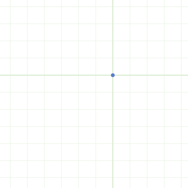

Dask-PatternSearch
==================

**This project is in alpha phase.**  Please join the discussion and experiment
with it, but be aware that it may eat your cat.  Better documentation coming soon.

The Pattern
-----------

Installation Instructions
-------------------------

I recommend ``conda``, and right now ``dask-patternsearch`` depends on the
development version of ``distributed``.  In your conda environment, run::

    conda install dask distributed -c conda-forge
    pip install git+https://github.com/dask/dask.git --upgrade
    pip install git+https://github.com/dask/distributed.git --upgrade
    pip install git+https://github.com/eriknw/dask-patternsearch.git --upgrade

Python 2.7 and 3.4, 3.5, and 3.6 are tested.

Getting Started
---------------

Here is a simple example optimizing a trivial sphere function with minimum at 0.

.. code-block:: Python

    >>> import numpy as np
    >>> import distributed
    >>> from dask_patternsearch import search

    >>> def sphere(x):
    ...     return x.dot(x)

    >>> client = distributed.Client()
    >>> x0 = np.array([12.3, 4.5])
    >>> stepsize = np.array([1, 1])
    >>> best, results = search(sphere, x0, stepsize, client=client, stopratio=1e-4)
    >>> best.point
    array([ 0.,  0.])

Useful Links
------------

http://www.cs.wm.edu/~va/research/sirev.pdf
